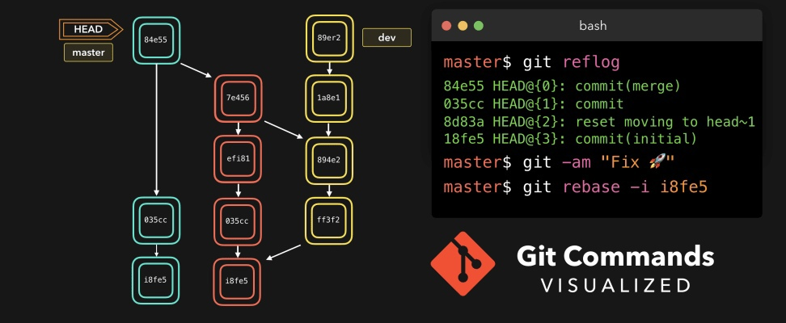

# Домашняя работа по 2 семинару

# Что такое Git?
Git - это консольная утилита, для отслеживания и ведения истории изменения файлов, в вашем проекте. Чаще всего его используют для кода, но можно и для других файлов. Например, для картинок - полезно для дизайнеров.

С помощью Git-a вы можете откатить свой проект до более старой версии, сравнивать, анализировать или сливать свои изменения в репозиторий.

Репозиторием называют хранилище вашего кода и историю его изменений. Git работает локально и все ваши репозитории хранятся в определенных папках на жестком диске.

Так же ваши репозитории можно хранить и в интернете.

## Установка на Windows

Основой интерфейс для работы с Git-ом является консоль/терминал. Это не совсем удобно, тем более для новичков, поэтому предлагаю поставить дополнительную программу с графическим интерфейсом (кнопками, графиками и т.д.). О них я расскажу чуть позже.

Но для начала, все же установим сам Git.

Проходим по этой [ссылке](https://git-scm.com/download/win), выбираем под вашу ОС (32 или 64 битную), скачиваем и устанавливаем.

## Основные команды

1. **git init** – инициализация локального репозитория

2. **git status** – получить информацию от ***git*** о его текущем состоянии

3. **git add** – *добавить файл или файлы к следующему коммиту*

4. **git commit -m “message”** – создание ***коммита***

5. **git log** – *вывод* на экран истории всех коммитов с их хеш-кодами

6. **git checkout** – переход от одного ***коммита*** к другому

7. **git checkout master** – вернуться к актуальному состоянию и продолжить работу

8. **git diff** – увидеть *разницу* между текущим файлом и закоммиченным файлом

9. **git branch** - просмотреть список веток в репозитории

10. **git branch** <Название ветки> - создать новую ветку

11. **git checkout** <Название ветки> - переход к другой ветке

12. **git branch** -d <Назвине ветки> - удалить ветку

13. **git clone <url-адрес репозитория>** – клонирование внешнего репозитория на
локальный ПК

14. **git pull** – получение изменений и слияние с локальной версией

15. **git push** – отправляет локальную версию репозитория на внешний
